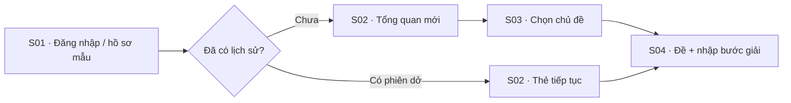
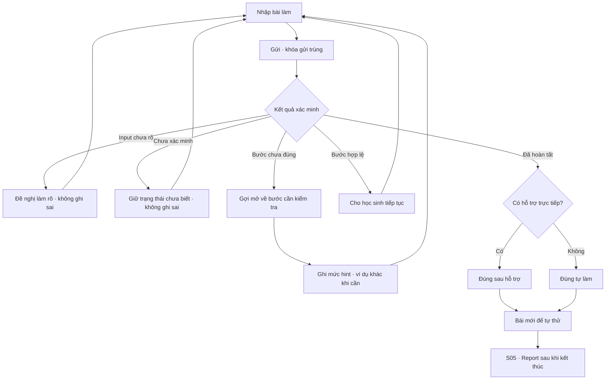
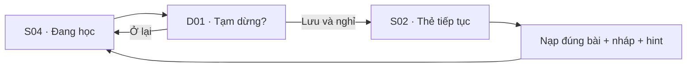
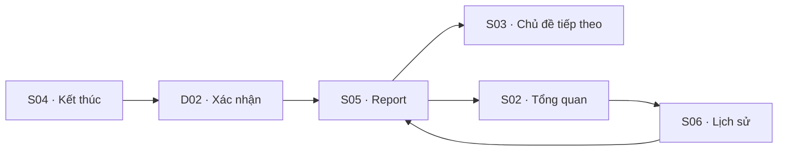

# Mở — User flow và bản đồ trạng thái

Mở `index.html#flow` trong trình duyệt để xem bản tương tác. Các mã dưới đây tương ứng với prototype và yêu cầu trong PRD 0.2.

## A. Bắt đầu học

Người mới không được mặc định yếu tất cả kỹ năng. Chọn chủ đề là đường vào bắt buộc; diagnostic riêng là phần bổ sung của sản phẩm sau này. Prototype không có xác thực thật.

## B. Vòng gợi mở

Observation chỉ được ghi tối đa một lần cho cơ hội đo đủ điều kiện. Sửa sau hint không tạo lần quan sát tự làm mới. Đáp án cuối của bài nhiều skill không tự cung cấp bằng chứng cho mọi skill.

## C. Tạm nghỉ và tiếp tục

Trong prototype, dữ liệu lưu trên trình duyệt hiện tại. Trong sản phẩm, session/checkpoint và idempotency phải do backend bảo đảm. Dừng không đồng nghĩa đáp án sai.

## D. Kết thúc và quay lại

Report dựa trên log: tự làm đúng, đúng có hỗ trợ và số quan sát tách riêng. Phiên không có bài gửi có report với số 0, không sinh thành tích giả.

## E. Nhánh ngoại lệ

| Trạng thái | Thông điệp / hành động | Tác động kiến thức |
|---|---|---|
| Rỗng | Viết bước đầu tiên hoặc mô tả điều chưa rõ | Không cập nhật |
| Chưa rõ | Hỏi bổ sung một thông tin cụ thể | Không ghi sai |
| Chưa xác minh | Nói rõ giới hạn, mời trình bày từng bước | Không ghi sai |
| Mất kết nối | Giữ nháp, hiện Thử lại | Không tạo bản ghi trùng |
| Xin đáp án | Gợi mở hoặc ví dụ khác | Ghi là hỗ trợ nếu liên quan |
| Mắc kẹt | Đổi hỗ trợ hoặc tạm nghỉ/kết thúc | Không tự tăng mastery |
| Cách giải khác | Chấp nhận nếu backend xác minh; nếu chưa thì abstain | Theo eligibility, không theo lời giải mẫu duy nhất |

## F. Traceability

| Màn hình/luồng | FR liên quan |
|---|---|
| S01 | FR-01 |
| S02–03 | FR-02–03, FR-15–16 |
| S04 | FR-04–14 |
| Tạm dừng/resume | FR-07, FR-11, FR-15 |
| S05 | FR-18 |
| S06 | FR-15–16, FR-18 |
| Nhánh chưa rõ/chưa xác minh | FR-04–06 |
| Retry/xung đột | FR-07, FR-11, FR-15 |

Các chức năng backend và quyền truy cập trong FR là yêu cầu bàn giao, không phải cam kết rằng prototype tĩnh đã triển khai chúng.
