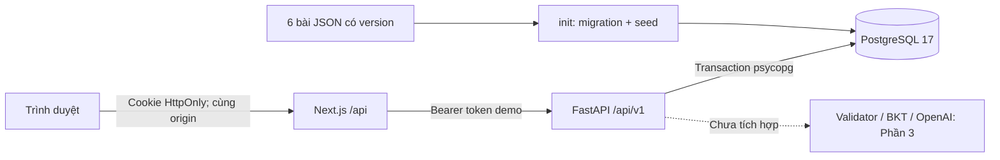

# Kiến trúc thực tế Phần 2

## Cấu trúc dữ liệu

| Bảng | Vai trò và ràng buộc |
|---|---|
| `schema_migrations` | Version + checksum SQL; migration đã chạy không được chỉnh âm thầm |
| `profiles`, `demo_tokens` | Hai profile nội bộ; DB chỉ lưu hash token, có hạn dùng |
| `topics`, `problems` | Registry; problem khóa `(problem_id, content_version)`; public/private JSON tách riêng |
| `sessions` | Chủ sở hữu, trạng thái, `state_version`, opportunity hiện tại, thời gian |
| `opportunities` | Một lần gặp bài; draft, mức hỗ trợ, relation, thứ tự, protocol, outcome |
| `turns` | Bài nộp/yêu cầu hint, assessment, phản hồi; unique session/request |
| `observations` | Evidence chuẩn; unique student/opportunity/skill; xác suất, version tham số/protocol |
| `mastery_history` | Một bản trước/sau cho mỗi observation; chưa phát sinh từ luồng học |
| `decisions` | Một quyết định cho mỗi turn; hiện là `defer / pipeline_not_integrated` |
| `requests` | Cache response + hash payload theo student/scope/request ID, lưu cùng transaction |

Foreign key ghép bảo vệ opportunity thuộc đúng phiên/profile, turn thuộc đúng opportunity và observation thuộc đúng skill/turn. FK phiên → opportunity hiện tại được kiểm tra cuối transaction để có thể tạo cả hai nguyên tử.

Seed chạy lại cùng phiên bản chỉ đối chiếu hash và bỏ qua bản đã có. Không `TRUNCATE`, không xóa phiên cũ, không tự nâng review status. Nội dung thay đổi cần version mới. Demo chọn bài chưa gặp trong phiên theo ID; đây là thứ tự xác định để kiểm tra lưu trữ, chưa phải policy thích ứng. Cùng family được gắn `near_practice`; bài từng gặp ở phiên khác là `repeat`; khác family là `cross_family`. Draft của bài trước vẫn nằm trong opportunity sau khi đổi bài.

## Một mutation được xử lý thế nào

1. Xác thực token demo và chủ sở hữu phiên; validate schema.
2. Mở transaction. Khóa advisory theo student/scope/request ID, đợi tối đa 5 giây.
3. Tìm cache: cùng ID + payload → trả kết quả đã commit; cùng ID + payload khác → 409 `idempotency_conflict`.
4. Nếu chưa có cache, khóa dòng session `FOR UPDATE`, so `expected_state_version`. Sai → 409 `state_conflict`.
5. Ghi thay đổi, tăng version và ghi response vào `requests` trong cùng transaction.
6. Chỉ trả thành công sau commit. Exception làm rollback. Nếu response mất sau commit, retry cùng ID vẫn nhận kết quả cũ, không chạy lại side effect.

Cache trả snapshot của request cũ, không hứa đó là state mới nhất sau các hành động khác. Client tải lại session nếu cần state hiện tại. Tạm dừng/tiếp tục không tạo opportunity hay observation. Finish cùng ID trả cache; finish lại với ID khác trên phiên đã đóng trả cùng report, không đóng hoặc cộng kết quả lần nữa.

Transaction dùng semantics của [Psycopg connection context](https://www.psycopg.org/psycopg3/docs/basic/transactions.html); khóa theo [PostgreSQL explicit locking](https://www.postgresql.org/docs/17/explicit-locking.html).

## API thực tế

Prefix backend: `/api/v1`. Next.js gọi qua `/api` cùng nguồn; danh sách route proxy được giới hạn.

| Method/path sau prefix | Body/chức năng |
|---|---|
| `GET /demo/profiles`, `POST /demo/login`, `GET /me` | Danh sách profile, chọn profile và đọc profile hiện tại |
| `GET /topics` | Trả `tutoring_ready=false`, cho phép thử lưu nội bộ nếu có bài |
| `POST /sessions` | `request_id`, `demo_profile_id`, `topic_id`; trả 201 |
| `GET /sessions` | 100 phiên cập nhật gần nhất của profile |
| `GET /sessions/{id}` | Public problem + draft + status/version + nhật ký toàn phiên |
| `PUT /sessions/{id}/draft` | Request ID, expected version, draft ≤ 2.000 ký tự; giữ khoảng trắng |
| `POST /sessions/{id}/turns` | Request ID, expected version, opportunity ID, action và steps |
| `POST /sessions/{id}/pause`, `/resume`, `/next`, `/finish` | Request ID và expected version |
| `GET /sessions/{id}/report` | Số bài đã xem, lượt nộp, chưa xác minh, đúng độc lập/có hỗ trợ, observation, nhật ký |

Steps tối đa 12 dòng, mỗi dòng 160 ký tự. `request_hint` phải có steps rỗng. Phần 2 ghi nhận yêu cầu hint nhưng chưa đưa hint nên không tăng mức hỗ trợ. `response_source=system_unavailable` phân biệt thông báo hệ thống với AI/fallback đã duyệt.

Các lỗi chính: 401 `unauthorized`; 403 `demo_disabled/forbidden`; 404 `not_found`; 409 `state_conflict/idempotency_conflict/session_paused/session_completed/opportunity_conflict/content_exhausted/content_not_ready`; 422 `invalid_input`; 503 `database_unavailable` hoặc `network_unavailable` tại proxy. Response backend có `trace_id`, header `X-Trace-ID`, không trả lỗi DB chứa chuỗi kết nối. Log turn có request/session/opportunity/turn ID; log lỗi DB có trace và SQLSTATE. Không log token hay nguyên văn bài làm.

## Contract Phần 1 và Phần 2

Contract `v1` là mô hình mục tiêu của tutor. Giữ nguyên để không sửa âm thầm fixture/spec cũ. [OpenAPI Phần 2](../../../../contracts/phase2/openapi.json) xuất trực tiếp từ code là nguồn tham chiếu API đang chạy: bổ sung `SessionView`, `SaveDraft` giữ khoảng trắng, `TurnResult` chưa có tutor, `Report` cho cả phiên chưa đóng và `ApiErrorBody` có trace. Phần 3 cần chủ động đồng bộ contract khi bổ sung kết quả tutor/BKT.

## Điểm nối Phần 3 chưa hoàn thành

Hiện submit ghi turn + assessment `unverified` + decision + version + response cache trong một transaction. Chưa tạo observation/mastery giả. Phần 3 phải thêm kiểm tra eligibility và writer observation/mastery vào **cùng transaction của mutation**, trước cache/commit. Unique constraint không thay thế kiểm tra eligibility hay tính toán BKT.

Khi thêm mastery hiện tại theo student/skill, cần khóa tương ứng để hai phiên của cùng học sinh không ghi đè trạng thái. Tests Phần 2 đã kiểm tra unique và rollback trên dữ liệu constraint tổng hợp; chưa chứng minh pipeline BKT hoặc checkpoint LangGraph chạy end-to-end. Không giữ transaction DB trong một cuộc gọi LLM dài; thiết kế stage/checkpoint phải giữ nguyên tính idempotent khi tích hợp.
