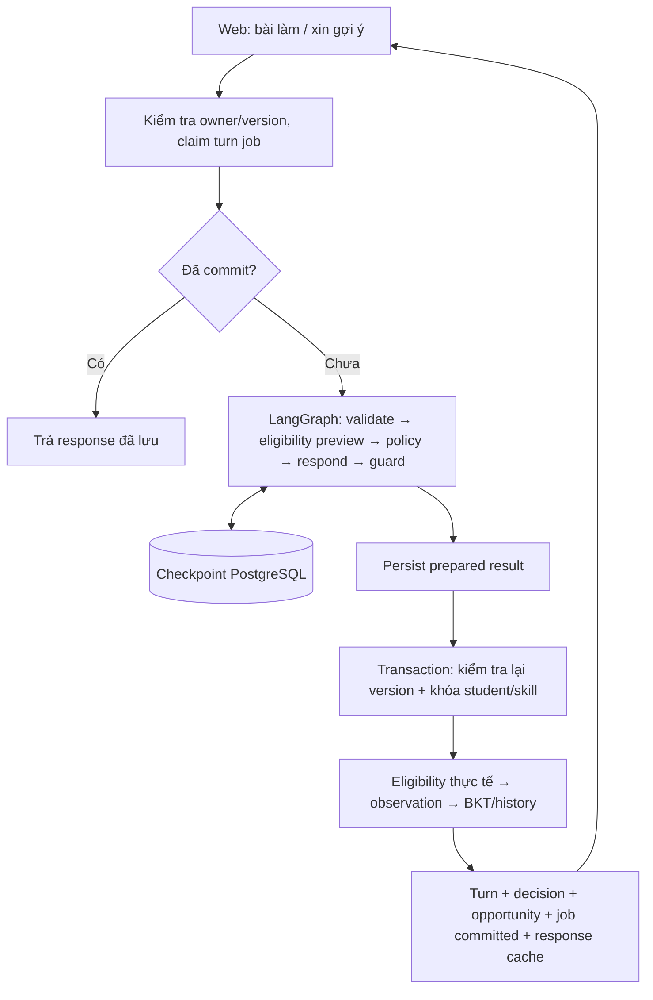

# Kiến trúc và quyết định Phần 3



## Bộ chấm

Parser đệ quy tự viết chỉ tạo cặp hệ số hữu tỉ `(a,b)` biểu diễn `a*x+b`. Mỗi vế tối đa 80 node, ngoặc sâu 12, tử/mẫu tối đa 256 bit; giới hạn bước/ký tự áp dụng trước xử lý. Không dùng `eval`, `sympify` hoặc parser SymPy trên chuỗi người dùng. SymPy chỉ nhận `Rational`, `Symbol` và biểu thức tuyến tính đã dựng an toàn; `solveset(..., domain=Reals)` xác định tập nghiệm để đối chiếu bước.

So sánh tập nghiệm chấp nhận các cách biến đổi hợp lệ trong phạm vi tuyến tính một ẩn. Dòng lặp nguyên đề đầu bài được loại khỏi số thứ tự bước đánh giá. Phát hiện bước không tương đương đầu tiên rồi dừng, không chấm lại các bước kéo theo. Nghiệm cuối sai đơn lẻ không bị gán một misconception cụ thể. Giả thuyết lỗi chỉ có khi khớp bước sai tác giả đã mô tả; nhãn luôn là `suspected`.

Biến ở mẫu, nhân tạo bậc hai, lũy thừa và nhiều ẩn ngoài phạm vi. `1/2x`, số thập phân dùng dấu phẩy, phép chia 0 hay lời văn chưa rõ không tự bị coi là đáp án sai. Bước tương đương nhưng chưa cô lập x là `unverified/valid_partial`.

Mỗi lượt submit chạy worker Python riêng. `subprocess.run(timeout=...)` hủy và thu hồi process nếu quá thời gian; kết quả là `unverified/cannot_verify`, không cập nhật BKT. Timeout bao gồm khởi động/import: máy quá tải có thể từ chối tạm thời cả bài hợp lệ. Runtime dùng 3 giây sau khi giới hạn 1 giây gây lỗi ở lượt browser đầu trên máy này; lần đo worker khi đã ổn định khoảng 0,61 giây. Mục tiêu 1 giây trong grammar ban đầu chưa được coi là SLA đã đạt. Lỗi worker có thông điệp hệ thống, không đổ lỗi định dạng cho người học.

Tham chiếu: [SymPy solveset](https://docs.sympy.org/latest/modules/solvers/solveset.html). Bộ bài tác giả và các ca số học bổ sung chỉ là regression tests, không phải tập đánh giá accuracy độc lập.

## BKT và eligibility

Thứ tự loại trừ: đã có observation → đã hỗ trợ → bài lặp → luyện gần sau hỗ trợ cùng family/source group → chưa xác minh → sai skill đích. Bài tiếp cùng họ nhưng chưa hề hỗ trợ không tự bị loại; quan hệ `initial` biểu diễn cơ hội chưa có hỗ trợ trong trường hợp đó. Bài từng mở ở phiên trước bị đánh dấu lặp một cách bảo thủ, kể cả chưa nộp.

Chỉ skill `SK-LIN-SOLVE` được cập nhật. Với prior `p`, guess `g`, slip `s`, learn `t`:

```text
prediction_before = p*(1-s) + (1-p)*g
posterior_correct = p*(1-s) / prediction_before
posterior_incorrect = p*s / (1-prediction_before)
mastery_after = posterior + (1-posterior)*t
```

Phiên bản `g2-bootstrap-1.0.0`: prior 0,2; learn 0,1; guess 0,2; slip 0,1; forget 0. **Nguồn các con số là giả định kỹ thuật của dự án**, không phải ước lượng từ nghiên cứu hay bộ dữ liệu. Chọn các xác suất nằm trong (0,1) để minh họa cập nhật có thể tính tay; baseline phiên ngắn không quên. Cấu trúc BKT tham chiếu [pyBKT](https://github.com/CAHLR/pyBKT); nguồn/rationale/version lưu trong JSON.

Ví dụ tính tay: prior 0,2 → dự đoán đúng 0,34. Quan sát đúng → mastery 49/85 ≈ 0,57647; quan sát sai → mastery 7/55 ≈ 0,12727. Đây là ví dụ cơ chế, không phải mức thành thạo đã được kiểm chứng.

Khóa student/skill bảo vệ cả hai phiên khác nhau của cùng học sinh. Unique observation tiếp tục bảo vệ student/opportunity/skill. Observation, mastery hiện tại, history trước/sau, outcome, turn, decision, job status và response cache commit cùng nhau. Fail sau BKT làm rollback tất cả. Report dùng snapshot mastery của observation cuối trong phiên; phiên khác về sau không làm thay đổi báo cáo cũ.

## OpenAI và kiểm soát câu trả lời

Dùng Responses API, JSON Schema strict, `store=false`, không cấp tools. Chỉ gửi đề, các bước người dùng, trạng thái xác minh, action và danh sách cách diễn đạt. Không gửi key, danh tính, đáp án tham chiếu, mastery hay toàn bộ DB. Nội dung người học đặt trong dữ liệu của user message, không được đổi policy.

Model chọn nguyên văn một trong hai biến thể theo policy. Guard kiểm tra schema và **khớp chính xác danh sách cho phép**; câu khác bị thay bằng template. Cách này chặn câu trả lời tự phát/lộ lời giải từ model trong phạm vi catalog hiện tại, nhưng không chứng minh catalog có chất lượng sư phạm. Timeout, lỗi API, refusal/incomplete, JSON sai và vượt giới hạn phiên đều có `fallback_reason`; không lưu nội dung output bị từ chối vào response công khai.

Nguồn `openai` nghĩa là có model trả kết quả được chấp nhận. `draft_template` nghĩa là câu dự phòng thử nghiệm, **không phải câu đã được người duyệt**. `content_review_status` vẫn ghi draft, kể cả model chọn câu đó. Chưa triển khai `reviewed_fallback` vì không có review thực tế.

Tham chiếu: [OpenAI Structured Outputs](https://developers.openai.com/api/docs/guides/structured-outputs). Structured Outputs giới hạn cấu trúc; kiểm soát sư phạm và tính toán vẫn do code/corpus, không giao cho model.

## Transaction, job lease và checkpoint

Inference nằm ngoài transaction giữ khóa session. LangGraph checkpoint sau các node được ghi bằng transaction ngắn qua saver PostgreSQL. Turn job lease 45 giây chống hai worker đồng thời gọi model cho một request. Lỗi graph chủ động trả lease để retry; nếu process chết hẳn, retry sau lease có thể tiếp quản.

Graph chưa commit không được ghi mastery. Khi đã có prepared result, transaction cuối kiểm tra lại session version và eligibility với khóa student/skill, rồi mới cập nhật BKT. Đây là điều chỉnh thứ tự so với flow đề xuất trong plan để không giữ khóa DB trong lúc đợi model; LLM không sử dụng hoặc sửa BKT.

Checkpoint giúp chạy tiếp node còn thiếu, ví dụ guard lỗi sau node model thì retry không cần gọi model lại. Response cache là nguồn quyết định cuối cùng khi turn đã commit; reload/resume không chạy graph hoặc tăng observation. Saver lưu cả pending writes; state chỉ chứa dữ liệu ứng dụng, không chứa API key, không bật pickle fallback.

**Giới hạn:** nếu process chết sau khi OpenAI trả lời nhưng trước khi checkpoint ghi được, lần phục hồi có thể gọi lại OpenAI. Đảm bảo “một lần” áp dụng cho observation/mastery/turn đã commit, không phải mọi chi phí HTTP trong mọi kiểu crash. Hạn mức phiên là giới hạn turn job được phép vào model, không phải ngân sách tiền cứng cho crash/retry này.

Tham chiếu: [LangGraph persistence](https://docs.langchain.com/oss/python/langgraph/persistence). Không cung cấp API public để đọc private checkpoint. Chưa có chính sách dọn checkpoint/job theo thời gian; bổ sung trước vận hành dài hạn.
