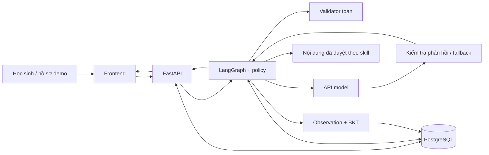

# Phần 6 — Đóng gói, demo và nộp MVP

**Trạng thái:** Chưa thực hiện.  
**Mục tiêu:** Người chấm mở được tài liệu, chạy được hệ thống và thấy đúng hành vi MVP đã kiểm thử.

## 1. README sản phẩm

- [ ] Mô tả sản phẩm, phạm vi G2 và những phần chưa triển khai so với PRD.
- [ ] Yêu cầu môi trường và version đã kiểm thử; lệnh cài/chạy/seed/migration chính xác.
- [ ] `.env.example` chỉ có tên biến và giá trị mẫu; nơi cấu hình API model, DB, origin và các giới hạn.
- [ ] Hướng dẫn khởi động, health check, URL và cách chọn hồ sơ demo.
- [ ] Sample queries/bài làm: đúng độc lập, sai phân phối, xin gợi ý, input chưa rõ; chỉ rõ đề tương ứng.
- [ ] Lệnh kiểm thử, vị trí manual evidence và các lỗi thường gặp khi setup.
- [ ] Không đưa dataset lớn hoặc dữ liệu người dùng vào Git nếu không cần cho demo; xác định quyền sử dụng trước khi phát hành dữ liệu.
- [ ] Một thành viên khác thực hiện từ checkout sạch; sửa mọi bước còn thiếu.

Lệnh, tên biến và version phải lấy từ mã đã hoàn thành; không sao chép giả định trong kế hoạch rồi gọi là hướng dẫn đã kiểm chứng.

## 2. Architecture diagram và data flow

Tạo `docs/architecture.md` với Mermaid và bản ảnh/PDF dễ xem. Gắn nhãn thành phần thực sự chạy, thành phần bên ngoài và phần dự kiến.

Sơ đồ dự kiến để đối chiếu khi triển khai:



Đây là **kiến trúc dự kiến**, chưa phải bằng chứng hệ thống đã tồn tại. Bản nộp phải điều chỉnh theo mã chạy thật; không vẽ Neo4j/pgvector như đã tích hợp nếu chưa chạy. Sơ đồ/ghi chú data flow cần giải thích input, validation, eligibility, cập nhật duy nhất, sinh/kiểm tra phản hồi, persistence và report.

## 3. Video demo 3 phút

| Thời lượng | Nội dung |
|---|---|
| 00:00–00:15 | Tên đề tài, vấn đề giải quyết, phạm vi demo |
| 00:15–00:35 | Mở hệ thống, hồ sơ demo, chủ đề và bài |
| 00:35–01:20 | Nhập bước sai, chỉ ra phản hồi tập trung bước sai đầu tiên và câu hỏi gợi mở |
| 01:20–01:50 | Sửa bài sau hỗ trợ; thể hiện ghi nhận assisted |
| 01:50–02:15 | Thử bài mới và/hoặc tạm dừng–tiếp tục; chọn đoạn chứng minh rõ luồng |
| 02:15–02:40 | Report thật; giải thích ngắn tự làm đúng/có hỗ trợ/observation |
| 02:40–03:00 | Sơ đồ, đường dẫn repo/evidence và giới hạn MVP |

Quay ứng dụng thật, chữ đủ đọc và không lộ secrets. Nếu cắt thời gian chờ hoặc dùng replay phải chú thích, không gọi toàn bộ là live. Không dùng video prototype thay cho bằng chứng backend/AI. Diễn tập một lần để kiểm soát thời lượng và response model.

## 4. Kiểm tra PR

- [ ] Có ít nhất 10 PR đã merge theo yêu cầu, không chỉ 10 commit hoặc 10 PR đang mở.
- [ ] Lập bảng số PR, tiêu đề, link, tác giả và ngày merge.
- [ ] Nhánh/commit demo chứa các thay đổi cần nộp; định nghĩa repo/nhánh hợp lệ đối chiếu quy định gate.
- [ ] Các PR có thay đổi có ý nghĩa, mô tả và cách xác minh.

## 5. Folder/link tổng hợp deliverables

Tạo một nơi tổng hợp khi các tài liệu đã có. Có thể dùng folder Drive và liên kết về GitHub; đảm bảo người chấm có quyền xem.

```text
MVP_G2/
  00_README_SUBMISSION.md    # chỉ mục mọi link, commit nộp, phạm vi và giới hạn
  01_DEMO.mp4               # video khoảng 3 phút
  02_ARCHITECTURE.pdf       # sơ đồ components + data flow
  03_REPOSITORY.md          # repo, README setup và danh sách ≥10 PR merged
  04_EVAL_EVIDENCE/          # bảng ca manual + ảnh/log/output thực tế
```

Đây là cấu trúc dự kiến; thư mục `plan/` hiện chỉ chứa kế hoạch và không phải bộ deliverables đã hoàn thành.

## 6. Trước khi nộp

- [ ] Tất cả link mở được bằng tài khoản/quyền của người xem; video phát được.
- [ ] README chạy được và chỉ đúng commit đã kiểm thử.
- [ ] Đủ sơ đồ, video, số PR và ít nhất 5 ca manual có actual output.
- [ ] Không có secrets trong repo, tài liệu, ảnh và video.
- [ ] Đại diện nhóm tự nộp link tổng hợp qua `/gate submit` trong Discord theo thông báo.
- [ ] Lưu xác nhận gate nhận bài; mục tiêu hoàn thành đóng gói trước 20:00 ngày 04/10, hạn thông báo 23:59.

## 7. Sau gate

Rà phản hồi, xử lý nợ kỹ thuật đã ghi nhận, hoàn thiện KG/RAG và mở rộng lên 8–10 concept theo mốc trong brief. Sau đó mới tiếp tục mục tiêu 40 concept, benchmark BKT/analyzer, baseline/ablation và pilot theo kế hoạch 12 tuần. Đối chiếu lại lịch với giảng viên khi mốc thực tế thay đổi.
